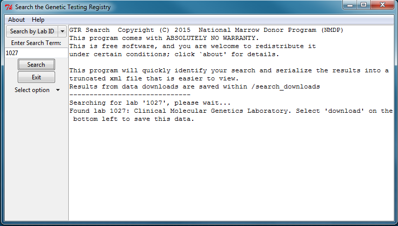
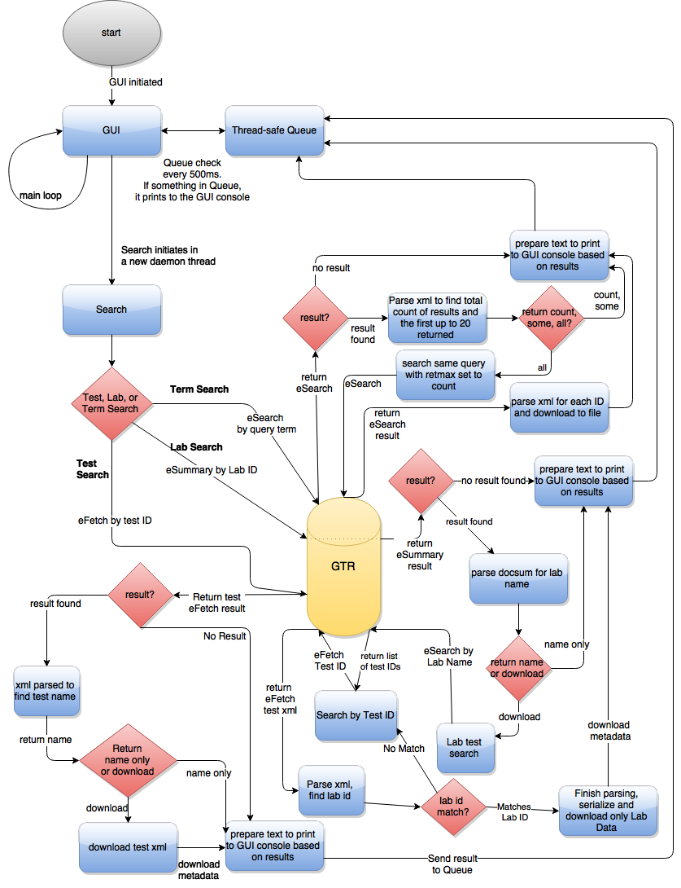

# GTR Search

gtr_search.py is a Python 2.7 program that provides a GUI for searching and downloading GTR data using the E-utilities.

### How to run this program

First, make sure you have followed the steps in the root [README](../README.md)

There are multiple ways to execute a python program, it is too exhaustive to list here.

Here are some resources if you need help executing this program:

* [Python on Windows](https://docs.python.org/2/faq/windows.html)
* [Python on Macintosh](https://docs.python.org/2/using/mac.html)
* [Python on Unix](https://docs.python.org/2/using/unix.html])

### Instructions

Instructions are also included in the 'Help' tab of the program.

There are three main types of searches (Test, Lab, Term) that are currently offered in four options:

* Search by Test ID
* Search by Lab ID
* Search by Gene ID
* Search by Gene Symbol or Name

Search by Test ID and Lab ID will provide the name of the test or lab if found, and offers the option to download the
xml data for the result.

Search by gene produces test IDs that are related to the search. By default, the program will provide the number of
 results found. An option to display up to the first 20 results to the program's console is available as 'return some',
 and an option to download a list of all the IDs is available as 'download all'.

#### Screenshots:

#### Flow Diagram:

If you are curious what the program is doing:

